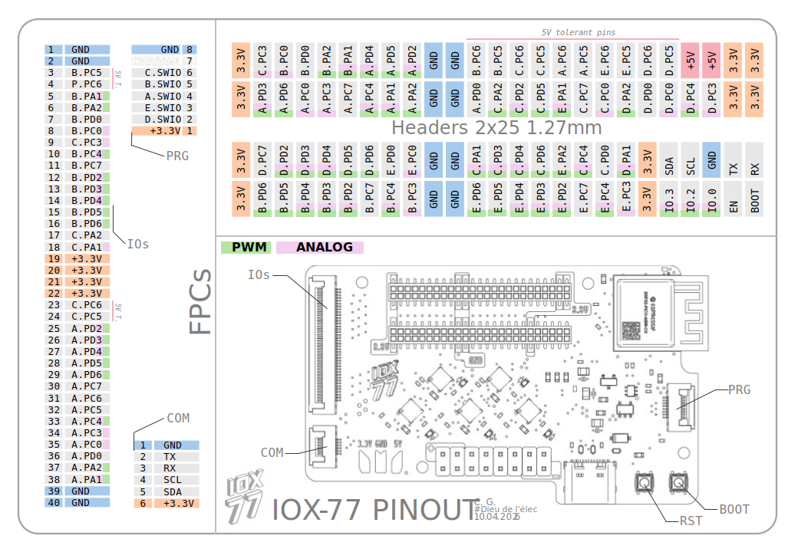
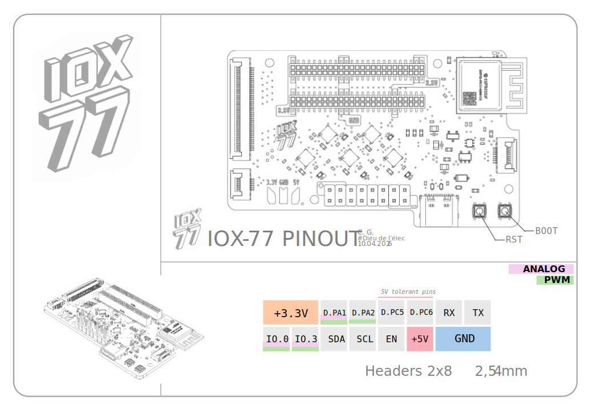
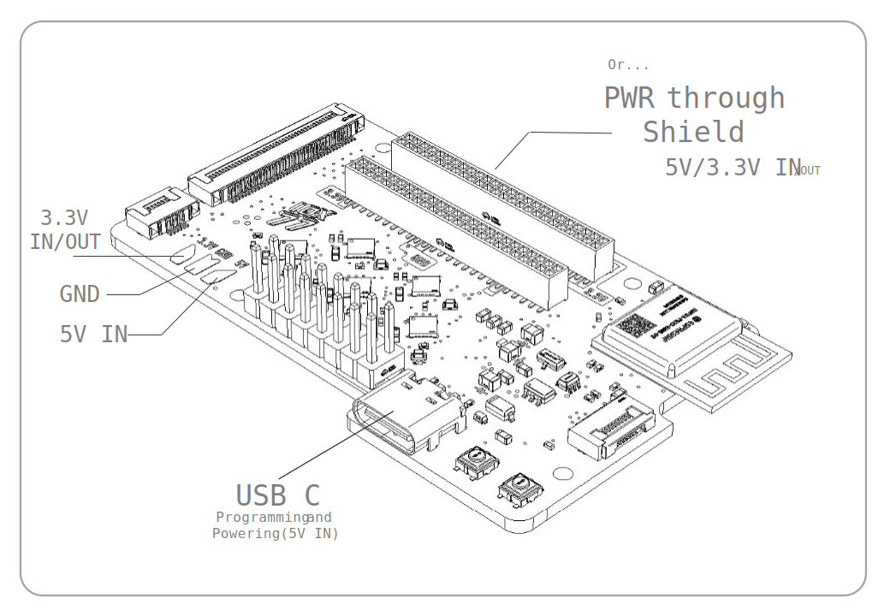

# IOX-77: An ESP32 based Devboard with 75 GPIOs available (ESP32 Core with 5 CH32V003 MCUs)

  

  

   
  

  

The IOX-77 is an ESP32-C3-MINI-1-N4 based development board that comes with a lot more GPIOs than typical ESP32 devboards. The Main ESP32 core communicates via I2C with 5 cheap RISC-V MCUs (5 CH32V003). This way, each CH32 adds 14 more GPIOs. It is an upgraded ESP32 devboard, gathering the computational power of the ESP32 and the many GPIOs offered by all the CH32

This board comes with more IOs than the Arduino Mega, while being cheaper, smaller, and having WiFi / Bluetooth capabilities. 

Unlike basic GPIO expanders, each CH32V003 can be programmed to execute a specific task in parallel with the ESP32. (the CH32V003 has 16KB of FLASH). It's like a 6 core configuration: 6 tasks can run at the same time!
Both the ESP32 and the 5 CH32V003 runs at 3.3V, but among the 75 available GPIOs, 10 are 5.0V tolerant.

Thanks to the two 2x25 1.27mm pitched headers, shields can easily be plugged onto the IOX-77 (obviously, they need to be custom shields with the right two 1.27mm 2x25 male headers)
Modules can also be connected to the devboard via I2C or UART (one 6P .5mm FPC is dedicated to these protocols). A 40 pins FPC is another way of accessing some of the GPIOs

# Key features 
- **ESP32 C3** main Core
- **x5 CH32V003** MCUs
- **Runs at 3.3V**, but 10 GPIOs are 5V tolerant
- **75 Usable GPIOs**
- **USB-C** for programming / powering the board
- **relatively small devboard**: 71mm x 42mm (slighly longer than the Arduino® UNO but way smaller than the Arduino® MEGA)
- **Wifi/Bluetooth** calpabilities
- **Onboard 3.3V LDO Voltage regulator** [TLV75733PDBVR] up to 1A, input 4V - 5.5V
- **Multiple Ways of Powering the devboard**: USB-C 5V IN, solderable pads +5V IN or +3.3V IN, Power pins on the headers *(it's possible to power the devboard via a shield)*
- **ALL Pins (GPIOs, PWR pins, UART, I²C, ESP32 ENABLE and BOOT pins) are accessible with two 2x25 1.27mm pitched female headers**
- **40P .5mm FPC connector** for accessing 32 of the GPIOs (coming out of the CH32s), with GND and +3.3V pins
- **6P .5mm FPC connector**: I²C, UART, GND and +3.3V pins
- **2x8 common 2.54mm pitched male header for quick prototyping** including x2 +3.3V, x1 +5V, x2 GND, TX and RX (ESP32), SCL and SDA, EN pin (ESP32), x2 GPIOs (ESP32), x2 Analog pins and x2 5V tolerant IO pins (CH32V003 MCU #D)
- **8P .5mm FPC connector** used for programming the 5 CH32V003. Each MCU has a SWIO pin. All the CH32Vs can be programmed one by one with a dedicated programmer (WCH link-E)
- Each NRST pin of the CH32s is controlled by the ESP32. It serves 2 purposes:
  1. If one CH32 isn't responding (when the ESP32 can't communicate with this specific CH32 via I²C for example), the ESP32 can reboot the faulty MCU
  2. When the devboard enters low power mode and if the CH32v003 aren't needed, they can go to sleep mode when the I²C master (ESP32) asks for it (each CH32V003 only draws a few µAmps in sleep mode). When the ESP32 needs them back, it simply need to pull down the NRST pins to reset the MCUs

# PCB design
This 4 Layer PCB has been designed in EASYEDA (Pro edition).

# Firmware
The final code is now available, with the Arduino library for the ESP32.

The Arduino® library IOX.h for the ESP32 C3 make the use of this devboard easy, controlling the 'external' GPIOs (handling I2C com with the 5 CH32s) like we do with any other devboard (pinMode(), digitalWrite(), digitalRead(), analogRead(), analogWrite() functions ...). The CH32 can be programmed using MounRiver Studio and even though I've made a ready to use software to make the CH32 act as smart GPIO expander, the main advantage of this setup is the ability to run custom software, macros, on the CH32, to free the main MCU, ESP32, from some tasks.

The current code for each CH32 takes ~51% of RAM and ~44% of FLASH, which let enough space for the user to implement custom macros that can run on an CH32 while the ESP32 can do more important things.

# Schematic

# Pinout

# PCB Layout

Top Copper Layer (+3.3V plane)

Inner Layer 1

Inner Layer 2

Bottom Copper Layer (GND plane)

# Rendering (Fusion 360)

# BOM

Qty	| Part	| Value | link
--- | --- | --- | ---
1|ESP32-C3-MINI-1-N4 MCU||https://www.lcsc.com/product-detail/C2838502.html
11|MLCC 0603|100nF|https://www.lcsc.com/product-detail/C66501.html
1|MLCC 0603|10nF|https://www.lcsc.com/product-detail/C519406.html
1|MLCC 0603|1µF |https://www.lcsc.com/product-detail/C1592.html
1|MLCC 0805|10µF |https://www.lcsc.com/product-detail/C1713.html
2|TVS diode SOD882 LESD8D3.3CAT5G|3.3V|https://www.lcsc.com/product-detail/C5563754.html
1|DIODE SOD123 1N5819||https://www.lcsc.com/product-detail/C82544.html
1|FPC 6 PINs FPC-05F-6PH20||https://www.lcsc.com/product-detail/C2856796.html
1|FPC 8 PINs FPC-05F-8PH20||https://www.lcsc.com/product-detail/C2856797.html
1|FPC 40 PINs FPC-05F-40PH20||https://www.lcsc.com/product-detail/C2856812.html
1|MALE HEADER HDR-M 2.54 2x8|2.54mm|https://www.lcsc.com/product-detail/C492425.html
5|LED 0603 XL-1608UOC-06||C965800|https://www.lcsc.com/product-detail/C965800.html
1|P CHANNEL MOSFET SI2393DS-T1-GE3||https://www.lcsc.com/product-detail/C5273032.html
10|Resistor 0402|10K|https://www.lcsc.com/product-detail/C2906861.html
2|Resistor 0402|22|https://www.lcsc.com/product-detail/C2929994.html
2|Resistor 0402|5.1K|https://www.lcsc.com/product-detail/C2906874.html
10|Resistor 0402|1K|https://www.lcsc.com/product-detail/C2906864.html
1|Resistor 0402|499K|https://www.lcsc.com/product-detail/C2998054.html
1|Resistor 0402|100K|https://www.lcsc.com/product-detail/C2906859.html
2|PUSH BUTTON TS-1075S-A1B2-D4||https://www.lcsc.com/product-detail/C492872.html
3|TVS DIODE SOD523 LESD5D5.0CT1G|5V|https://www.lcsc.com/product-detail/C5199850.html
2|MALE HEADER HC-PM127-4.3H-2x25PS|1.27mm|https://www.lcsc.com/product-detail/C27985226.html
1|LDO REGULATOR TLV75733PDBVR|3.3V|https://www.lcsc.com/product-detail/C485517.html
1|IDEAL DIODE CONTROLLER DZDH0401DW-7||https://www.lcsc.com/product-detail/C3235552.html
5|CH32V003F4U6 MCU [SLAVES]||https://www.lcsc.com/product-detail/C5299908.html
1|USB Connector TYPE-C 16PIN 2MD(073)|| https://www.lcsc.com/product-detail/C2765186.html
---|---|---|---
1|WCH-linkE||(Aliexpress - 5$) https://fr.aliexpress.com/item/1005005180653105.html
1|PCB |||(JLCPCB) https://jlcpcb.com
1|Stencil||(JLCPCB) https://jlcpcb.com

# Build

